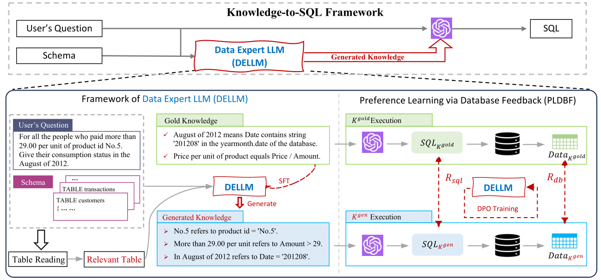

# Knowledge-to-SQL
**[2025/08] All the code has been released. This repository will no longer be updated. Please feel free to email or open an issue if you need any assistance.**

**[2024/10] Check our video presentation in [Underline](https://underline.io/events/466/posters/18354/poster/102023-knowledge-to-sql-enhancing-sql-generation-with-data-expert-llm)!**

**[2024/08] The video presentation of our paper will be available soon.**

**[2024/08] The presentation of our paper are scheduled at Virtual Poster Session 2, check the poster and slides [here](./slides).**

**[2024/05] Our paper is accepted as a findings paper in ACL2024!**

We propose a novel framework **Knowledge-to-SQL** that leverages **Data Expert Large Language Model (DELLM)** to enhance SQL generation, the paper is available [here](https://aclanthology.org/2024.findings-acl.653.pdf).



## Setup

### Environment

**The GPU resources we use in our study is 4*A800-SXM4-80G with the corresponding CUDA version 12.1,** we strongly recommend using the torch version above 2.0.

```shell
# Clone the repository
git https://github.com/Rcrossmeister/Knowledge-to-SQL.git
cd ./Knowledge-to-SQL

# Create the conda environment
conda create -n dellm python=3.11.3
conda activate dellm

# Install the required packages
pip install -r requirements.txt
```

### Dataset

We mainly focus on **[BIRD](https://bird-bench.github.io/)** dataset in our study, we also support **[Spider](https://yale-lily.github.io/spider)** dataset for robustness study. You can also deploy DELLM on your own database by formatting your setup according to the standard benchmarks above.

**Dataset Preparation**

The BIRD and Spider dataset used in the paper could be **directly downloaded from the BIRD and Spider Leaderboard.** After downloading and unzipping, the contents should be placed into the following path **`./dataset/bird/train/`** and **`./dataset/bird/dev/`**. The Spider dataset will not be used for training, after downloading, place the corresponding contents into `./dataset/spider/`.

**Pre-processing**

As soon as the datasets are prepared, you should run the pre-processing script to generate the training data. The pre-processing step is not compulsory, you can also modify it to produce a specific input format.

```shell
python dataset/preprocessor.py \
    --data_path ./dataset/bird/train/train.json \
    --db_root_path ./dataset/bird/train/train_databases/ \
    --output_path ./model/data/SFT-EKG.json
```

The data for supervised fine-tuning of DELLM will be saved in `./model/data` after pre-processing.

### Models

We use [LLaMA-2](https://github.com/meta-llama/llama) as the backbone model in our paper, and we also support several popular open-source LLMs like [ChatGLM](https://github.com/THUDM/ChatGLM-6B) and [Qwen](https://github.com/QwenLM/Qwen). To load the model weight locally, using [LLaMA-2-13b](https://huggingface.co/meta-llama/Llama-2-13b-hf) as an example:

```shell
mkdir backbone_model && cd backbone_model
git lfs install
git clone https://huggingface.co/meta-llama/Llama-2-13b-hf
```

Or you can replace the local path at argument `--model_name_or_path` by the repository name of huggingface (e.g. `meta-llama/Llama-2-13b-hf`) in the following training script, the model weight will be downloaded and loaded automatically.  

## Training

The training implementaion was inspired by **[LLaMA Factory](https://github.com/hiyouga/LLaMA-Factory)**, you can check their technical report [here](https://arxiv.org/abs/2403.13372). We will use the SFT and DPO module during our training. You can also use the PPO algorithm by following the instructions of LLaMA Factory with the exact same dataset as DPO.

### Quick Start

We provide a script to quick start upon BIRD dataset, which supervised fine-tune the DELLM over the annotated expert knowledges proposed by BIRD train [(Li et al, 2023)](https://arxiv.org/pdf/2305.03111), and further train DELLM via preference learning with database feedback.

```shell
cd ./model && sh run.sh 
```

## Evaluation

If you run the script above, the generated expert knowledge for BIRD dev will be saved in `./model/out` (you can modify the path in the script to obtain generated knowledge for Spider dev). This knowledge can be used to assist SQL generation. For further evaluation, we follow the official evaluation protocol proposed by [BIRD](https://github.com/AlibabaResearch/DAMO-ConvAI/tree/main/bird) and [Spider](https://github.com/taoyds/spider) for **SQL generation** then **execution verification**. The corresponding evaluation scripts can be obtained from their official repositories, and **you can evaluate our knowledge-to-SQL framework by replacing the official evidence with the generated knowledge**.

## Citation

Please cite our paper if you include Knowledge-to-SQL in your work:

```
@inproceedings{hong2024knowledge,
    title = "Knowledge-to-{SQL}: Enhancing {SQL} Generation with Data Expert {LLM}",
    author = "Hong, Zijin  and
      Yuan, Zheng  and
      Chen, Hao  and
      Zhang, Qinggang  and
      Huang, Feiran  and
      Huang, Xiao",
    booktitle = "Findings of the Association for Computational Linguistics ACL 2024",
    year = "2024"
}
```

Feel free to reach out via email if you need any help:

```
zijin.hong@connect.polyu.hk
```
